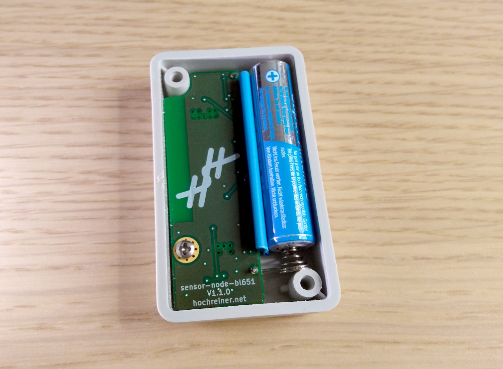
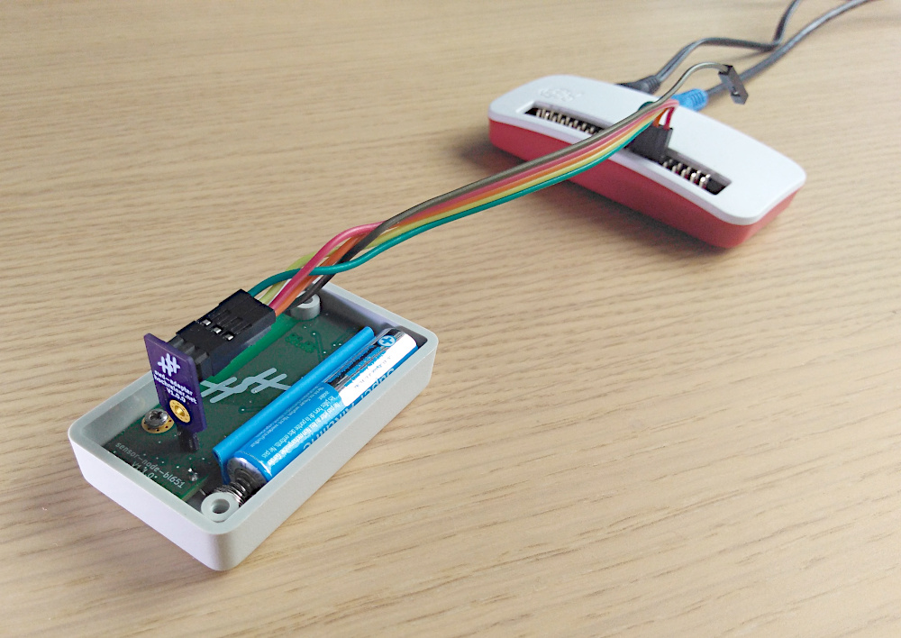

Sensor Node BL651
~~~~~~~~~~~~~~~~~

The goal of this project is to create a simple sensor node based on the BL651 module running on a single AAA battery.

Safety Measures
===============

Reverse polarity protection
--------------------------

Reverse polarity protection is provided by a P-channel MOSFET connecting the drain to the positive terminal of the battery, the gate to ground, and the source to positive terminal of the load.

Over current protection
-----------------------

Over current protection is provided by the DC-DC-converter.
The short circuit current is max 150 mA @ about 2 V (1/3 W).

Under voltage protection
------------------------

Since the idea is to use the system with NiMH batteries, care has to be taken to not discharge them below 1.1 V.
Under voltage protection will be provided by the MCU by actively measuring the battery voltage and going into sleep mode once the threshold is reached.
This method comes with a higher risk, as the MCU has to actively measure the voltage and react to under voltage conditions.

Design
======

ADC
---

The basic setup for measuring the battery voltage is a voltage divider with R1 between V_bat and the ADC pin and R2 between the ADC pin and ground.
In parallel with R2, a capacitor (C_ext) is used to avoid big influences of the sample capacitor filling up.

For the design of the voltage measurement, a `blog post by Nordic <https://devzone.nordicsemi.com/nordic/nordic-blog/b/blog/posts/measuring-lithium-battery-voltage-with-nrf52>`_ was used as guidance.
The sample frequency (f_sample) was taken as 1/30 Hz, which should leave enough buffer for a measurement every minute.
Using the sampling frequency and the capacitance of the sample capacitor (C_sample = 2.5 pF), the effective impedance of the ADC input pin (R_input) can be calculated.

.. code-block::

    R_input = 1 / (f_sample * C_sample) = 1 / (1 / 30 * 2.5e-12) = 12e12 Ohm

To obtain good measurements, the R_input needs to be much larger than the resistor values of the voltage divider.
Assuming 12-bit resolution, C_ext comes out to be about 10 nF.

The expected voltage range of the batteries (NiMH) is 1.4-1.0 V.
The internal reference of the nRF52810 is 0.6 V.
Putting in a little margin 1.5 V were used for the calculation.

.. code-block::

    V_meas = V_bat * R2 / (R1 + R2)
    0.6 / 1.5 = R2 / (R1 + R2)
    0.4 = R2 / (R1 + R2)

Since a measurement frequency of 1/60 Hz was planned, it needs to be assured that the capacitor charges within that time.
Therefore, the time constant of tau_0 = R1 * C_ext was calculated.
A value of 15 MOhm for R1 and 100 nF (10 times the minimum calculated earlier) was assumed.

.. code-block::

    R1 = 15 MOhm = 1.5e7 Ohm
    C_ext = 100 nF = 1e-7 F
    tau_0 = 1.5e7 * 1e-7 = 1.5

The charging factor could then be calculated based on the above assumptions.

.. code-block::
    V_C_ext / V_bat = 1 - e^(-t / tau_0)
    0.9987 = 1 - e^(-10 / 1.5)

Hence, after 10 seconds the capacitor should be charged to more than 99%.
R2 can then be calculated to be 10 MOhm.

.. code-block::

    2/3 R1 = R2 = 10 MOhm

TPS60313DGS
-----------

The passives were used as given in the example circuit.
Since the second output is not being used, the decoupling capacitors for this output were not added.

Connectors
----------

Minimum pin length for the bottom entry connectors is 3.15 mm.

Sensors
=======

SHT4x
-----

This sensor worked fine with similar designs.
Due to the internal pull-ups of the nRF52810, no external pull-ups are required.

LSM303AGR
---------

This sensor worked fine with similar designs.
Due to the internal pull-ups of the nRF52810, no external pull-ups are required.

**Note**

The LSM303AGR is currently (June 2021) not available.
Therefore, additional footprints for additional sensors performing its functions were added.

MMC5603NJ
---------

This sensor replaces the magnetic sensor contained in the LSM303AGR.

MXC4005XC
---------

This sensor replaces the accelerometer contained in the LSM303AGR.

Programming
===========

The firmware for this device can be found in the repository `hannes-hochreiner/sensor-net-nrf52810-firmware <https://github.com/hannes-hochreiner/sensor-net-nrf52810-firmware>`_.
A suitable programming connector can be found in the repository `hannes-hochreiner/swd-adapter <https://github.com/hannes-hochreiner/swd-adapter>`_.

Tests
=====

+-----------------------------+--------+--------+--------+
|                        Unit | V1.0.0 | V1.1.0 | V1.2.0 |
+=============================+========+========+========+
|                       Power |   OK   |   OK   |        |
+-----------------------------+--------+--------+--------+
| Reverse polarity protection |   OK   |   OK   |        |
+-----------------------------+--------+--------+--------+
|     Over current protection | Note 1 | Note 3 |        |
+-----------------------------+--------+--------+--------+
|    Under voltage protection |   tbt  |   OK   |        |
+-----------------------------+--------+--------+--------+
|                       SHT4x |   tbt  |   OK   |        |
+-----------------------------+--------+--------+--------+
|                   LSM303AGR |   tbt  | Note 4 |        |
+-----------------------------+--------+--------+--------+
|                   MMC5603NJ |   tbt  |   OK   |  N/A   |
+-----------------------------+--------+--------+--------+
|                   MXC4005XC |   tbt  | Note 5 |  N/A   |
+-----------------------------+--------+--------+--------+
|                  Connectors | Note 2 |   OK   |        |
+-----------------------------+--------+--------+--------+

**Note 1**

Over current protection did not work as intended as the resistance of the fuses was too high to start with.

**Note 2**

The footprints of both connectors had problems (although different ones).
It was possible to scrape the pads of the programming connector free and subsequently program the module.

**Note 3**

Over current protection is provided by the DC/DC converter, but was not tested.

**Note 4**

The LSM303AGR is not available at the moment (summer 2021).

**Note 5**

It was not possible to read the markings on the MXC4005XC.
There was a 50% chance of getting the orientation right.
The chip did not pass the smoke test.
